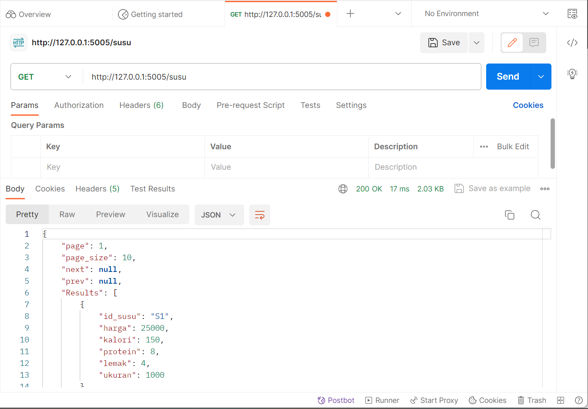
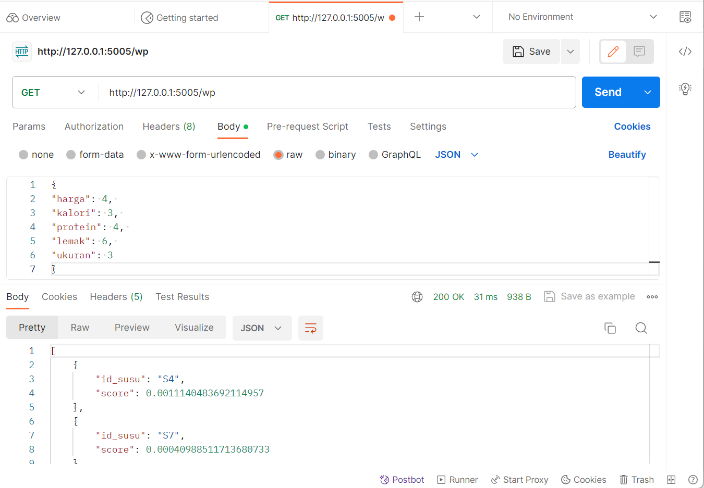

# UAS spk_web

## Install requirements

    pip install -r requirements.txt

## Run the app
to run the web app simply  use

    python main.py

## Usage
Install postman 
https://www.postman.com/downloads/

get susu list

get recommendations saw

get recommendations wp

### TUGAS UAS
Implementasikan model yang sudah anda buat ke dalam web api dengan http method `POST`

INPUT:
{
    "harga": 5, 
    "kualitas_kamera": 5, 
    "kapasitas_baterai": 5, 
    "kinerja": 5, 
    "ukuran_layar": 5
}

OUTPUT (diurutkan / sort dari yang terbesar ke yang terkecil):

post recommendations saw

post recommendations wp
